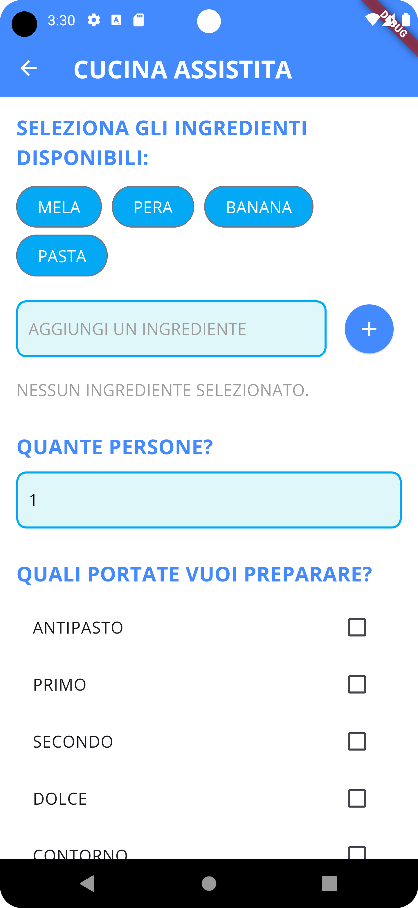
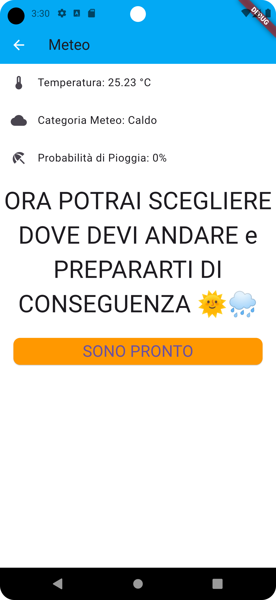

# Assistente Personale per Persone con Disabilità Cognitive

## Descrizione

**AidHome** è un'applicazione sviluppata in Flutter progettata per aiutare le persone con disabilità cognitive a gestire le attività quotidiane. L'app offre supporto in vari compiti come cucinare, vestirsi, fare la spesa, allenarsi, pulire la casa e gestire la lavatrice, adattandosi alle esigenze specifiche degli utenti.

## Screenshot

  
  

## Funzionalità

- **Cucinare**: Assistenza nella preparazione dei pasti basata sugli ingredienti disponibili.
- **Vestirsi**: Suggerimenti per l'abbigliamento in base al meteo attuale tramite OpenWeatherMap.
- **Fare la Spesa**: Creazione di liste della spesa personalizzate.
- **Allenamento**: Piani di allenamento su misura.
- **Pulizia Casa**: Organizzazione delle attività di pulizia.
- **Gestione Lavatrice**: Promemoria e istruzioni per l'uso della lavatrice.
- **Sistema di Punteggio**: Incremento del punteggio utente al completamento delle attività.
- **Effetto Confetti**: Feedback visivo celebrativo al completamento delle istruzioni.

## Tecnologie Utilizzate

- **Flutter**: Framework per lo sviluppo dell'app.
- **Hive**: Database locale per la gestione dei dati utente.
- **Confetti**: Libreria per effetti visivi celebrativi.
- **Google Fonts**: Per una tipografia accattivante.
- **OpenWeatherMap API**: Per ottenere dati meteorologici in tempo reale.

## Installazione

### Prerequisiti

- **Flutter SDK**: Assicurati di avere Flutter installato. [Guida all'installazione di Flutter](https://flutter.dev/docs/get-started/install)
- **Git**: Per clonare il repository.

